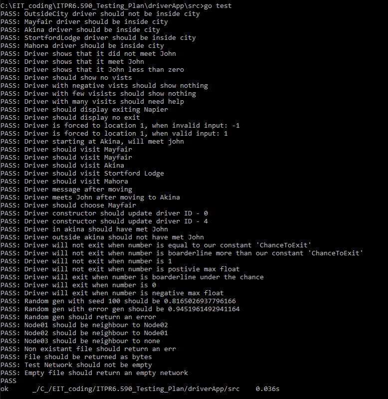

# Test Report: Test Findings

### Discoveries
One of our interpreted requirements was to have the drivers have a change to exit of about 20%. This meant that the program would have a chance to showcase some of the features such as "Visiting john" and displaying varying messages. These features initially would not have been very visible as the drivers would have exited about 50% of the time.

### Test Results
Throughout the testing phase of the development, the code implementation was redesigned.  
In the code [issues](https://github.com/mitchellwarr/ITPR6.590_Testing_Plan/issues?utf8=%E2%9C%93&q=) section of this repository, the difficulties were documented.  

The random generator posed an issue with test setup. It wasn't difficult to set up a new generator with a set seed, but knowing that a generator with a seed of 5 will return after running it through the method, meant running the method once with it and taking its result. This meant it was assumed the method was working in the first place in order to use the output as the base line. The only thing this would protect from is if either the workings of the method changed, or if the random generator code changed.  

The nature of the testing methodology used meant that the code structure needed to have small functions of one or few concerns. For instance, the visit message function was originally one function handling all three possibilities for the message. Later the function instead called three smaller functions to handle the logic for each individual requirement. That opened up the possibility to test each aspect of the visit message individually.  

Along with the message functions, the move function was also split up. This was done so because the move function for the drive takes in the random generator. To make things easier to test, the logic was abstracted away from the generator by putting into a few small functions that would take the result of the generator. This allowed the move function to use the small functions with the generator, but also allowed the tests to have an easier set up and more control over testing the requirements.  

We have performed unit tests. There are no intergration tests. The main method performs tasks but no way to test if they are performed in the correct order. eg. Print "-----" dashes at the end of each driver is not tested. This is because there is no funcation that can quickly check if this has been done. Therefore, if someone removes this "fmt.Println("-----")" line from the code, then no test will alert us of that fact that we do not line up with the specifications. 

### Observations
A lot of code has needed to be abstracted or operations exposed, so that more control can be given to testing methods for setting up and verification.  

The visit message was split up into three different functions so that each aspect could be tested individually. Also, the test messages were made to be global strings so that the testing methods could use them to build the correct expected string.

### Imposed test limits
With the locations object, little was done to expand its testing. Creating an array of different JSON map files just to check that the network loader was expansive seemed unnecessary. It was only tested to work with the created Map JSON file and that if the file couldn't be found, that it won’t break the system.  

For the testing of the random arguments, extra care was not taken to the boundaries of equivalence classes like 0 - 0.5 - 1, where the boundaries are 0-0.49999 0.5-0.999999. This is because it does not matter if the random generator comes up with 0.24999999999999999999999999999999999999999999999 and it returns a 1 instead of a 2; because that’s not the point of the class. Care was taken to test <0 and >=1 however.  

### What could have been done better
The biggest thing that could have been improved was the code structure design process. The classes were designed with testing in mind, but the entire process of creating the method signatures was built at the same time that the tests were designed. This meant that certain things were overlooked, or weren't foreseen, until after the code had started to be filled in and it became apparent that changes in the code structure were needed in order to properly accommodate the tests. This process came down to refactoring, which itself is a part of the methodology, but could it could still have been handled sooner.

### Failing tests
We currently do not have any failing tests, this may be due to our background in coding. The tests were written by the programmers, and not by an analysist.  

These tests are purely whitebox, which is only one style of testing. We have not organised for blackbox testing to be completed. 

### Testing Evidence
Please see below links for testing   

